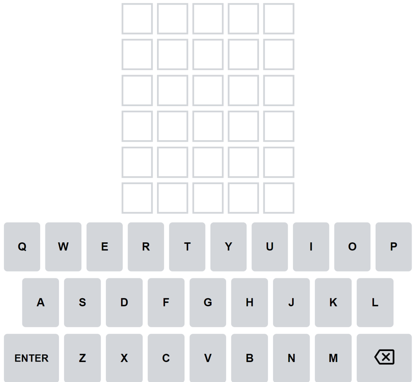
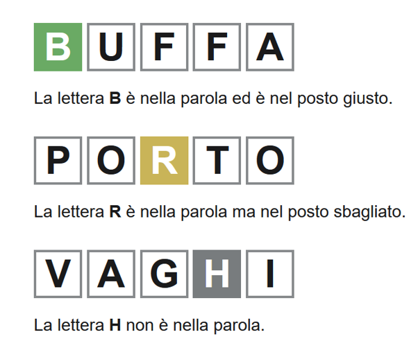
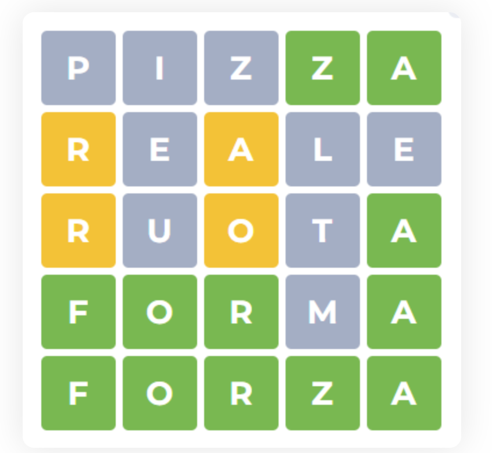

# Assegnazione Progetto

## Wordle

Gioco di parole:
* Indovina una parola di 5 lettere in 6 tentativi
* Dopo ogni tentativo, i colori delle tessere cambieranno per mostrare il **feedback**

[Versione ufficiale in inglese](www.nytimes.com/games/wordle)  

### Variante:
* Interfaccia a linea di comando (CLI)
* Parole in lingua italiana 
