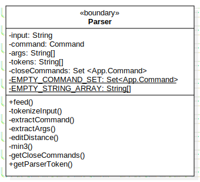
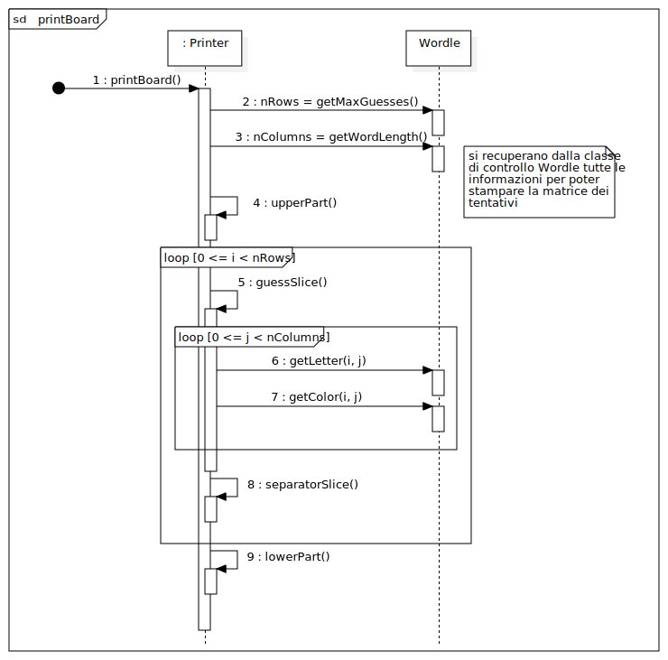
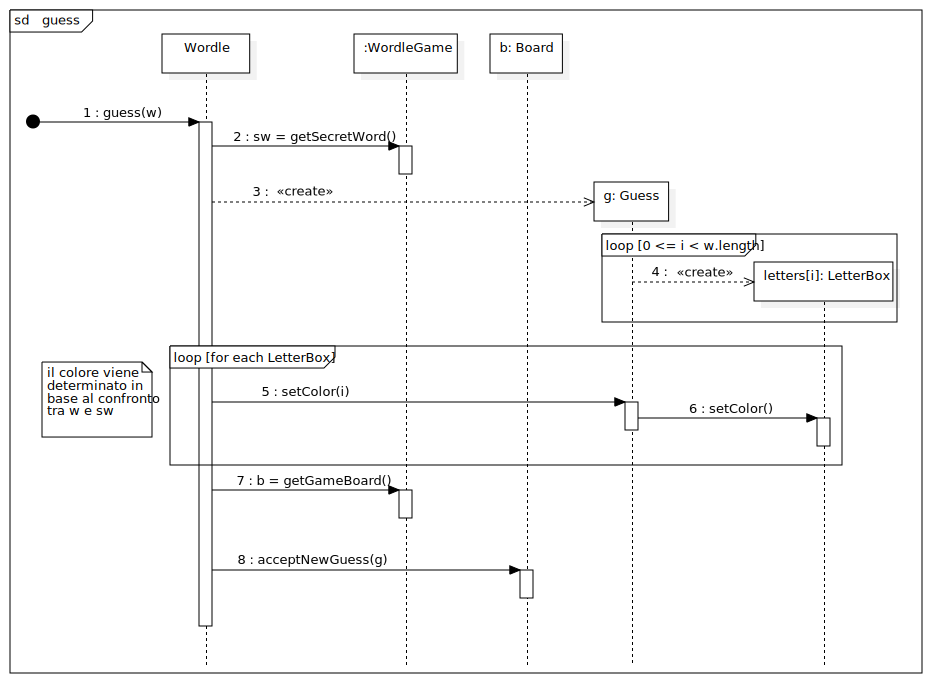

# Report
## 1. Introduzione

Wordle è un videogioco in cui il giocatore deve indovinare una parola segreta, avendo a disposizione 6 tentativi che dovranno essere parole di una lunghezza
    prestabilita (nel nostro caso 5 lettere). Ad ogni tentativo, ogni lettera della parola inserita viene evidenziata in:

- **VERDE** se è contenuta nella parola segreta ed è nella giusta posizione.
- **GIALLO** se è contenuta nella parola segreta ma in una posizione diversa.
- **GRIGIO** se non è contenuta nella parola segreta.

La versione presentata in questo progetto è una variante del gioco originale che utilizza un'interfaccia a linea di comando. Si gioca inserendo i seguenti comandi:
    
- `/gioca` : inizia una nuova partita (la parola segreta deve essere impostata)
- `/nuova <parola>`: imposta `<parola>` come parola segreta
- `/mostra`: visualizza la parola segreta impostata
- `/abbandona`: abbandona la partita in corso
- `/esci`: chiude il gioco
- `<parola>`: per effettuare un tentativo

*Nota: tutto il testo inserito a seguito di un comando, e separato da esso con uno o più caratteri di spaziatura, viene ignorato.*

## 2. Modello di dominio

Si è considerata la griglia di gioco come una matrice di tentativi a dimensione fissa (6 righe, 5 colonne), che inizialmente viene raffigurata come una griglia vuota, le cui righe verranno popolate dall'alto verso il basso con le parole rappresentanti i tentativi validi. Questo giustifica la molteplicità scelta, in quanto il numero di legami della matrice dei tentativi con i tentativi aumenta nel corso della partita.

<p align="center">
  
</p>


- L'attributo "vincente" di tentativo indica se la parola che compone il tentativo corrisponde alla *parolaSegreta* della partita.
- Il numero delle "righe" della matrice dei tentativi rappresenta il numero massimo di tentativi validi che possono essere effettuati. 
- Come si legge dai requisiti funzionali, è presente una tastiera all'interno del gioco: si è scelto di non rappresentarla nel modello di dominio in quanto non è trattata nell'iterazione corrente. 

## 3. Requisiti specifici

### 3.1 Requisiti funzionali

- **Impostazione manuale parola segreta**: *Come paroliere voglio impostare una parola segreta manualmente*  
   
    *Criteri di accettazione*:

    Al comando `/nuova<parola>`

    l’applicazione risponde:
    - Parola segreta troppo corta se i caratteri sono inferiori a quelli del gioco
    - Parola segreta troppo lunga se i caratteri sono superiori a quelli del gioco
    - Parola segreta non valida se ci sono caratteri che non corrispondono a lettere dell’alfabeto

    altrimenti

    - l’applicazione risponde con OK e memorizza la parola fino a chiusura applicazione. 

    È possibile cambiare la parola durante una sessione di gioco anche senza uscire dall’applicazione.

- **Mostra parola segreta**: *Come paroliere voglio mostrare la parola segreta*

    *Criteri di accettazione*: 

    Al comando `/mostra`

    l’applicazione risponde visualizzando la parola segreta.

- **Comando help**: *Come giocatore voglio mostrare l'help con elenco comandi*

    *Criteri di accettazione*:

    Al comando `/help` o invocando l'app con flag `--help` o `-h`

    il risultato è una descrizione concisa, che normalmente appare all'avvio del programma, seguita dalla lista di comandi disponibili, uno per riga, come da esempio successivo:
    - gioca
    - esci
    - ...

- **Inizio nuova partita**: *Come giocatore voglio iniziare una nuova partita*

    *Criteri di accettazione*:

    Al comando `/gioca`

    se nessuna partita è in corso l'app mostra la matrice dei tentativi vuota, ma senza mostrare la tastiera, e si predispone a ricevere il primo tentativo o altri comandi


- **Abbandono partita**: *Come giocatore voglio abbandonare la partita*

    *Criteri di accettazione*:

    Al comando `/abbandona`

    l'app chiede conferma 
    - se la conferma è positiva, l'app comunica l’abbandono
    - se la conferma è negativa, l'app si predispone a ricevere un altro tentativo o altri comandi

- **Chiusura gioco**: *Come giocatore voglio chiudere il gioco*

    *Criteri di accettazione*:

    Al comando `/esci`

    l'applicazione chiede conferma 

    - se la conferma è positiva, l'app si chiude restituendo un *zero exit code*
    - se la conferma è negativa, l'app si predispone a ricevere nuovi tentativi o comandi


- **Tentativo parola segreta**: *Come giocatore voglio effettuare un tentativo per indovinare la parola segreta*

    *Criteri di accettazione*:

    Digitando caratteri sulla tastiera e invio l’applicazione risponde:
    - *Tentativo incompleto* se i caratteri sono inferiori a quelli della parola segreta
    - *Tentativo eccessivo* se i caratteri sono superiori a quelli della parola segreta
    - *Tentativo non valido* se ci sono caratteri che non corrispondono a lettere dell’alfabeto

    altrimenti

    riempiendo la prima riga libera della matrice dei tentativi con i caratteri inseriti e colorando lo sfondo di:
    - *verde* se la lettera è nella parola segreta e nel posto giusto,
    - *giallo* se la lettera è nella parola segreta ma nel posto sbagliato
    - *grigio* se la lettera non è nella parola segreta.

    Se le lettere sono tutte verdi l’applicazione risponde: 
    ```
    Parola segreta indovinata
    Numero tentativi: <...>
    ```
    e si predispone a nuovi comandi.

    Se il tentativo fallito è l’ultimo possibile , l’applicazione risponde: 
    ```
    Hai raggiunto il numero massimo di tentativi. 
    La parola segreta è <...>
    ```
    e si predispone a nuovi comandi.


    Se la parola segreta non è stata impostata l’applicazione risponde
    ```
    Parola segreta mancante
    ```
    *nota: quest'ultima risposta è stata resa in modo leggermente diverso: se la parola segreta è mancante allora non è possibile iniziare la partita, per cui il controllo sulla parola segreta mancante è effettuato al momento di creazione della nuova partita. Risulta importante comunque controllare che una partita sia effettivamente in corso nel momento in cui si prova ad effettuare un tentativo.*


### 3.2 Requisiti non funzionali

- **RNF1**: il container docker dell’app deve essere eseguito da terminali che supportano Unicode con encoding UTF-8 o UTF-16.

    Elenco di terminali supportati :

    Linux:
    - terminal

    Mac OS
    - terminal

    Windows
    - Powershell
    - Git Bash (in questo caso il comando Docker ha come prefisso winpty; es: winpty docker -it ...)

    *Comando per l’esecuzione del container*

    Dopo aver eseguito il comando docker pull copiandolo da GitHub Packages, Il comando Docker da usare per eseguire il container contenente l’applicazione è:
    ```
    *docker run --rm -it ghcr.io/softeng2122-inf-uniba/wordle-knuth2122:latest*
    ```
    _**Importante**: il numero di colori supportato varia a seconda del terminale. Nello specifico, **git bash** supporta solamente 8 colori (codifica ANSI), come si può verificare dal seguente comando_

    <p align="center">
    
    </p>

    _Tra questi 8 colori non vi è il grigio (https://en.wikipedia.org/wiki/ANSI_escape_code#3-bit_and_4-bit), per cui abbiamo cercato una soluzione che funzionasse per ognuno dei terminali citati: non avendo trovato un modo semplice per individuare a run-time il numero di colori supportati in base al terminale su cui si sta eseguendo l'applicazione, abbiamo scelto di utilizzare il colore **bianco** come sostituto del grigio._

    _Per una migliore visualizzazione dei colori è comunque consigliato utilizzare il tema di default in ogni terminale (temi diversi potrebbero portare a una visualizzazione incoerente ed effetti non prevedibili a priori)._

## 5. OO design
Nella modellazione delle classi abbiamo mantenuto una costante attenzione sullla suddivisione dei ruoli **entity**, **control** e **boundary**.

- Le classi boundary, che costituiscono la parte dell'applicazione adibita alla *User Interface*, comunicano solo tra di loro e con la classe di controllo **Wordle**. 

- La classe **Wordle** permette di gestire interamente le partite del gioco: fornisce un'API composta da metodi che
  - sono indipendenti dalla particolare UI implementata
  - racchiudono tutte le interazioni con le classi di tipo entity non esponendole all'esterno
  - controllano tutte le condizioni di integrità per la corretta esecuzione delle partite.

- Le classi entity ricalcano le classi concettuali individuate nel modello di dominio: abbiamo ritenuto opportuno che la classe **LetterBox** (ovvero la cella nel modello di dominio) fosse interna al tentativo, in quanto ciò rispecchia il legame concettuale di composizione.

Abbiamo scelto di memorizzare in **Wordle**, tramite attributi statici, le impostazioni di gioco, che vengono impostate dall'utente prima che decida di inziare una partita: alla creazione dell'oggetto partita (classe **WordleGame**) i valori impostati saranno copiati come suoi attributi di istanza e caratterizzeranno la partita.
- Attualmente l'unica impostazione modificata dall'utente è la parola segreta
- Altre impostazioni sono il numero massimo di tentativi e la lunghezza delle parole, per ora non modificabili

### DIAGRAMMI USER STORY
Nei seguenti diagrammi vengono omessi alcuni dettagli facilmente comprensibili dal codice in quanto appesantirebbero inutilmente la lettura; inoltre i metodi che costituiscono l'interfaccia fornita dalla classe controllo vengono sempre riportati in quanto riteniamo importante evidenziare tutti i metodi per la comunicazione tra la _User Interface_ e l'_API Wordle_

_Nota: gli attributi e i metodi della classe parser vengono tutti utilizzati in ogni User story, per cui si presenta tale classe nella sua interezza in modo tale da non ripeterne i membri negli altri diagrammi delle classi._

<p align="center">

</p>

- **Impostazione manuale parola segreta**: *Come paroliere voglio impostare una parola segreta manualmente*  

<p align="center">
  
</p>

<p align="center">
  
</p>


- **Mostra parola segreta**: *Come paroliere voglio mostrare la parola segreta*

    I diagrammi delle classi e di sequenza di questa user story sono molto simili a quelli della precedente, con variazioni opportune di metodi:
    - _executePrintSecretWord_ al posto del metodo _executeSetSecretWord_
    - _getSecretWord_ al posto di _setSecretWord_


- **Comando help**: *Come giocatore voglio mostrare l'help con elenco comandi*

    Anche in questo caso i diagrammi delle classi e di sequenza sono molto simili a quelli di **Impostazione manuale parola segreta**, con variazioni opportune di metodi:
    - al posto della chiamata a _executeSetSecretWord_ vengono invocati direttamente i metodi _printDescription_ e _printHelp_ della classe **Printer**
    - non vengono effettuate chiamate alla classe **Wordle**


- **Inizio nuova partita**: *Come giocatore voglio iniziare una nuova partita*

  La molteplicità 0..1 nel legame tra **Wordle** e **WordleGame** è giustificata dal fatto che all'inizio la partita non esiste ma viene creata nel corso dell'interazione

<p align="center">
  
</p>

<p align="center">
  
</p>

Diagramma di sequenza **printBoard**:

<p align="center">
  
</p>


- **Abbandono partita**: *Come giocatore voglio abbandonare la partita*

<p align="center">
  
</p>

<p align="center">
  
</p>


- **Chiusura gioco**: *Come giocatore voglio chiudere il gioco*

    I diagrammi delle classi e di sequenza di questa user story sono molto simili a quelli della precedente, con variazioni opportune di metodi:
    - _executeExitGame_ al posto del metodo _executeQuitGame_
    - anche in questo caso ci sarà richiesta di conferma
    - al posto della chiamata di _endGame_ vi sarà la chiusura dell'applicazione


- **Tentativo parola segreta**: *Come giocatore voglio effettuare un tentativo per indovinare la parola segreta*

<p align="center">
  
</p>

<p align="center">
  
</p>

Diagramma di sequenza **guess**: Alla creazione delle **LetterBox** vengono inserite le lettere che compongono la stringa _w_ e viene impostato il valore *NO_COLOR*

<p align="center">
  
</p>

La realizzazione dell'algoritmo per l'impostazione dei colori prevede l'utilizzo di un dizionario in quanto è necessario memorizzare delle coppie in cui la chiave sia una lettera presente nella parola segreta e il valore associato sia il numero di occorrenze in cui è presente. 

In questo modo, a seguito del controllo posizionale che determina quali lettere saranno verdi, sarà stato decrementato il numero di occorrenze corrispondenti a queste.

Adesso risulta semplice, scandendo le lettere rimanenti (non verdi) da sinistra verso destra, determinare se una lettera del tentativo dev'essere colorata in giallo. Entrambe le condizioni seguenti devono essere verificate affinché ciò succeda:
- tale lettera dev'essere presente nel dizionario (ossia presente nella parola segreta)
- il numero di occorrenze rimanenti dev'essere maggiore di 0 (altrimenti tutte le altre lettere uguali sono state già segnalate)

Le lettere restanti sono, ovviamente, da colorare in grigio. 

_nota: se nel tentativo sono presenti più lettere uguali che dovrebbero essere colorate di giallo perché rispettano le condizioni viste, verrà data precedenza a quelle più a sinistra (da notare che a ogni passo verrà decrementato il numero di occorrenze contenuto nel dizionario)._


### Pattern design

Per migliorare la qualità di ciò che era già stato fatto precedentemente si è deciso di applicare i design pattern laddove possibile cosi da attuare soluzioni collaudate a problemi ricorrenti. In particolare è stato deciso di attuare il pattern "*COMMAND*", alla classe Command.java. L'applicazione di questo pattern ha permesso di evitare di accoppiare l'invocatore di una richiesta (ovvero la classe App) con la richiesta. Quindi è stata incapsulata la richiesta in un istanza di Command così che questa possa essere utilizzata come un qualsiasi oggetto e inoltre può essere accessibile anche in un secondo momento.

### Analisi delle scelte effettuate in adesione all'OO design


## 9. Analisi retrospettiva
### Sprint 1

Al termine dello sprint 1 è stato effettuato il meeting retrospettivo tramite videocoferenza su teams. E'stata utilizzata la whiteboard fornita dal software, perciò su ogni riga sono state raccolte le opinioni di ciasun membro del team e organizzata mediante lo schema "arrabbiato, triste, felice" come è possibile vedere di seguito.

<p align="center">
  
</p>