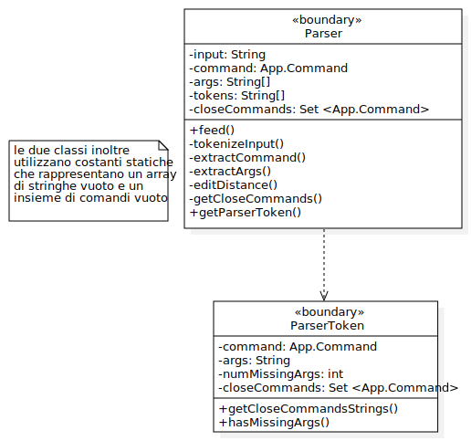

# Report
## 1. Introduzione

Wordle è un videogioco in cui il giocatore deve indovinare una parola segreta, avendo a disposizione 6 tentativi che dovranno essere parole di una lunghezza
    prestabilita (nel nostro caso 5 lettere). Ad ogni tentativo, ogni lettera della parola inserita viene evidenziata in:

- **VERDE** se è contenuta nella parola segreta ed è nella giusta posizione.
- **GIALLO** se è contenuta nella parola segreta ma in una posizione diversa.
- **GRIGIO** se non è contenuta nella parola segreta.

La versione presentata in questo progetto è una variante del gioco originale che utilizza un'interfaccia a linea di comando. Si gioca inserendo i seguenti comandi:
    
- `/gioca` : inizia una nuova partita (la parola segreta deve essere impostata)
- `/nuova <parola>`: imposta `<parola>` come parola segreta
- `/mostra`: visualizza la parola segreta impostata
- `/abbandona`: abbandona la partita in corso
- `/esci`: chiude il gioco
- `<parola>`: per effettuare un tentativo

*Nota: tutto il testo inserito a seguito di un comando, e separato da esso con uno o più caratteri di spaziatura, viene ignorato.*

## 2. Modello di dominio

Si è considerata la griglia di gioco come una matrice di tentativi a dimensione fissa (6 righe, 5 colonne), che inizialmente viene raffigurata come una griglia vuota, le cui righe verranno popolate dall'alto verso il basso con le parole rappresentanti i tentativi validi. Questo giustifica la molteplicità scelta, in quanto il numero di legami della matrice dei tentativi con i tentativi aumenta nel corso della partita.

<p align="center">
  
</p>


- L'attributo "vincente" di tentativo indica se la parola che compone il tentativo corrisponde alla *parolaSegreta* della partita.
- Il numero delle "righe" della matrice dei tentativi rappresenta il numero massimo di tentativi validi che possono essere effettuati. 
- Come si legge dai requisiti funzionali, è presente una tastiera all'interno del gioco: si è scelto di non rappresentarla nel modello di dominio in quanto non è trattata nell'iterazione corrente. 

## 3. Requisiti specifici

### 3.1 Requisiti funzionali

- **Impostazione manuale parola segreta**: *Come paroliere voglio impostare una parola segreta manualmente*  
   
    *Criteri di accettazione*:

    Al comando `/nuova<parola>`

    l’applicazione risponde:
    - Parola segreta troppo corta se i caratteri sono inferiori a quelli del gioco
    - Parola segreta troppo lunga se i caratteri sono superiori a quelli del gioco
    - Parola segreta non valida se ci sono caratteri che non corrispondono a lettere dell’alfabeto

    altrimenti

    - l’applicazione risponde con OK e memorizza la parola fino a chiusura applicazione. 

    È possibile cambiare la parola durante una sessione di gioco anche senza uscire dall’applicazione.

- **Mostra parola segreta**: *Come paroliere voglio mostrare la parola segreta*

    *Criteri di accettazione*: 

    Al comando `/mostra`

    l’applicazione risponde visualizzando la parola segreta.

- **Comando help**: *Come giocatore voglio mostrare l'help con elenco comandi*

    *Criteri di accettazione*:

    Al comando `/help` o invocando l'app con flag `--help` o `-h`

    il risultato è una descrizione concisa, che normalmente appare all'avvio del programma, seguita dalla lista di comandi disponibili, uno per riga, come da esempio successivo:
    - gioca
    - esci
    - ...

- **Inizio nuova partita**: *Come giocatore voglio iniziare una nuova partita*

    *Criteri di accettazione*:

    Al comando `/gioca`

    se nessuna partita è in corso l'app mostra la matrice dei tentativi vuota, ma senza mostrare la tastiera, e si predispone a ricevere il primo tentativo o altri comandi


- **Abbandono partita**: *Come giocatore voglio abbandonare la partita*

    *Criteri di accettazione*:

    Al comando `/abbandona`

    l'app chiede conferma 
    - se la conferma è positiva, l'app comunica l’abbandono
    - se la conferma è negativa, l'app si predispone a ricevere un altro tentativo o altri comandi

- **Chiusura gioco**: *Come giocatore voglio chiudere il gioco*

    *Criteri di accettazione*:

    Al comando `/esci`

    l'applicazione chiede conferma 

    - se la conferma è positiva, l'app si chiude restituendo un *zero exit code*
    - se la conferma è negativa, l'app si predispone a ricevere nuovi tentativi o comandi


- **Tentativo parola segreta**: *Come giocatore voglio effettuare un tentativo per indovinare la parola segreta*

    *Criteri di accettazione*:

    Digitando caratteri sulla tastiera e invio l’applicazione risponde:
    - *Tentativo incompleto* se i caratteri sono inferiori a quelli della parola segreta
    - *Tentativo eccessivo* se i caratteri sono superiori a quelli della parola segreta
    - *Tentativo non valido* se ci sono caratteri che non corrispondono a lettere dell’alfabeto

    altrimenti

    riempiendo la prima riga libera della matrice dei tentativi con i caratteri inseriti e colorando lo sfondo di:
    - *verde* se la lettera è nella parola segreta e nel posto giusto,
    - *giallo* se la lettera è nella parola segreta ma nel posto sbagliato
    - *grigio* se la lettera non è nella parola segreta.

    Se le lettere sono tutte verdi l’applicazione risponde: 
    ```
    Parola segreta indovinata
    Numero tentativi: <...>
    ```
    e si predispone a nuovi comandi.

    Se il tentativo fallito è l’ultimo possibile , l’applicazione risponde: 
    ```
    Hai raggiunto il numero massimo di tentativi. 
    La parola segreta è <...>
    ```
    e si predispone a nuovi comandi.


    Se la parola segreta non è stata impostata l’applicazione risponde
    ```
    Parola segreta mancante
    ```
    *nota: quest'ultima risposta è stata resa in modo leggermente diverso: se la parola segreta è mancante allora non è possibile iniziare la partita, per cui il controllo sulla parola segreta mancante è effettuato al momento di creazione della nuova partita. Risulta importante comunque controllare che una partita sia effettivamente in corso nel momento in cui si prova ad effettuare un tentativo.*


### 3.2 Requisiti non funzionali

- **RNF1**: il container docker dell’app deve essere eseguito da terminali che supportano Unicode con encoding UTF-8 o UTF-16.

    Elenco di terminali supportati :

    Linux:
    - terminal

    Mac OS
    - terminal

    Windows
    - Powershell
    - Git Bash (in questo caso il comando Docker ha come prefisso winpty; es: winpty docker -it ...)

    *Comando per l’esecuzione del container*

    Dopo aver eseguito il comando docker pull copiandolo da GitHub Packages, Il comando Docker da usare per eseguire il container contenente l’applicazione è:
    ```
    *docker run --rm -it ghcr.io/softeng2122-inf-uniba/wordle-knuth2122:latest*
    ```
    _**Importante**: il numero di colori supportato varia a seconda del terminale. Nello specifico, **git bash** supporta solamente 8 colori (codifica ANSI), come si può verificare dal seguente comando_

    <p align="center">
    
    </p>

    _Tra questi 8 colori non vi è il grigio (https://en.wikipedia.org/wiki/ANSI_escape_code#3-bit_and_4-bit), per cui abbiamo cercato una soluzione che funzionasse per ognuno dei terminali citati: non avendo trovato un modo semplice per individuare a run-time il numero di colori supportati in base al terminale su cui si sta eseguendo l'applicazione, abbiamo scelto di utilizzare il colore **bianco** come sostituto del grigio._

    _Per una migliore visualizzazione dei colori è comunque consigliato utilizzare il tema di default in ogni terminale (temi diversi potrebbero portare a una visualizzazione incoerente ed effetti non prevedibili a priori)._

## 5. OO design
Nella modellazione delle classi abbiamo mantenuto una costante attenzione sullla suddivisione dei ruoli **entity**, **control** e **boundary**.

- Le classi boundary, che costituiscono la parte dell'applicazione adibita alla *User Interface*, comunicano solo tra di loro e con le classi di controllo che implementano le interfacce di **PlayerController** o **WordSmithController**. 

- Le classi **PlayerController** e **WordSmithController** permettono di gestire interamente le partite del gioco: forniscono un'API composta da metodi che:
  - sono indipendenti dalla particolare UI implementata
  - racchiudono tutte le interazioni con le classi di tipo entity non esponendole all'esterno
  - controllano tutte le condizioni di integrità per la corretta esecuzione delle partite.

- Le classi entity ricalcano le classi concettuali individuate nel modello di dominio: abbiamo ritenuto opportuno che la classe **LetterBox** (ovvero la cella nel modello di dominio) fosse interna al tentativo, in quanto ciò rispecchia il legame concettuale di composizione.

Abbiamo scelto di memorizzare in **WordleSession**, tramite attributi di classe, le impostazioni di gioco, che vengono impostate dall'utente prima che decida di inziare una partita: alla creazione dell'oggetto partita (classe **WordleGame**) i valori impostati saranno copiati come suoi attributi di istanza e caratterizzeranno la partita.
- Attualmente l'unica impostazione modificata dall'utente è la parola segreta
- Altre impostazioni sono il numero massimo di tentativi e la lunghezza delle parole, per ora non modificabili

### DIAGRAMMI USER STORY
Nei seguenti diagrammi vengono omessi alcuni dettagli facilmente comprensibili dal codice in quanto appesantirebbero inutilmente la lettura; inoltre i metodi che costituiscono l'interfaccia fornita dalla classe controllo vengono sempre riportati in quanto riteniamo importante evidenziare tutti i metodi per la comunicazione tra la _User Interface_ e l'_API PlayerController_ o l'_API WordSmithController_

_Nota: gli attributi e i metodi della classe parser vengono tutti utilizzati in ogni User story, per cui si presenta tale classe nella sua interezza in modo tale da non ripeterne i membri negli altri diagrammi delle classi._

<p align="center">

</p>

- **Impostazione manuale parola segreta**: *Come paroliere voglio impostare una parola segreta manualmente*  

<p align="center">
  
</p>

<p align="center">
  
</p>


- **Mostra parola segreta**: *Come paroliere voglio mostrare la parola segreta*

    I diagrammi delle classi e di sequenza di questa user story sono molto simili a quelli della precedente, con variazioni opportune del metodo get e del metodo di stampa
    
- **Comando help**: *Come giocatore voglio mostrare l'help con elenco comandi*

    Anche in questo caso i diagrammi delle classi e di sequenza sono molto simili a quelli di **Impostazione manuale parola segreta**, con variazioni opportune dei metodi:
    - _printDescription_ e _printHelp_ della classe **WordlePrinter** al posto di _executeSetSecretWord_
    - non vengono effettuate chiamate alla classe **WordlePlayerController** o **WordleWordsmithController**


- **Inizio nuova partita**: *Come giocatore voglio iniziare una nuova partita*

  La molteplicità 0..1 nel legame tra **WordlePlayerController** e **WordleGame** è giustificata dal fatto che all'inizio la partita non esiste ma viene creata nel corso dell'interazione

<p align="center">
  
</p>

<p align="center">
  
</p>

Diagramma di sequenza **printBoard**:

<p align="center">
  
</p>


- **Abbandono partita**: *Come giocatore voglio abbandonare la partita*

<p align="center">
  
</p>

<p align="center">
  
</p>


- **Chiusura gioco**: *Come giocatore voglio chiudere il gioco*

    I diagrammi delle classi e di sequenza di questa user story sono molto simili a quelli della precedente, con variazioni opportune dei metodi:
    - impostazione attributo running a false al posto del metodo _endGame_
    - anche in questo caso ci sarà richiesta di conferma

- **Tentativo parola segreta**: *Come giocatore voglio effettuare un tentativo per indovinare la parola segreta*

<p align="center">
  
</p>

<p align="center">
  
</p>

Diagramma di sequenza **guess**: Alla creazione delle **LetterBox** vengono inserite le lettere che compongono la stringa _w_ e viene impostato il valore *NO_COLOR*

<p align="center">
  
</p>

La realizzazione dell'algoritmo per l'impostazione dei colori prevede l'utilizzo di un dizionario in quanto è necessario memorizzare delle coppie in cui la chiave sia una lettera presente nella parola segreta e il valore associato sia il numero di occorrenze in cui è presente. 

In questo modo, a seguito del controllo posizionale che determina quali lettere saranno verdi, sarà stato decrementato il numero di occorrenze corrispondenti a queste.

Adesso risulta semplice, scandendo le lettere rimanenti (non verdi) da sinistra verso destra, determinare se una lettera del tentativo dev'essere colorata in giallo. Entrambe le condizioni seguenti devono essere verificate affinché ciò succeda:
- tale lettera dev'essere presente nel dizionario (ossia presente nella parola segreta)
- il numero di occorrenze rimanenti dev'essere maggiore di 0 (altrimenti tutte le altre lettere uguali sono state già segnalate)

Le lettere restanti sono, ovviamente, da colorare in grigio. 

_nota: se nel tentativo sono presenti più lettere uguali che dovrebbero essere colorate di giallo perché rispettano le condizioni viste, verrà data precedenza a quelle più a sinistra (da notare che a ogni passo verrà decrementato il numero di occorrenze contenuto nel dizionario)._


### Pattern design

Per migliorare la qualità di ciò che era già stato fatto precedentemente si è deciso di applicare i design pattern laddove possibile cosi da attuare soluzioni collaudate a problemi ricorrenti. In particolare è stato deciso di attuare il pattern "*COMMAND*", alla classe App.Command.java. L'applicazione di questo pattern ha permesso di evitare di accoppiare l'invocatore di una richiesta (ovvero la classe App) con la richiesta. Quindi è stata incapsulata la richiesta in un istanza di Command così che questa possa essere utilizzata come un qualsiasi oggetto e inoltre può essere accessibile anche in un secondo momento.

### Analisi delle scelte effettuate in adesione all'OO design

Durante la progettazione e la stesura del codice del progetto si è voluta tenere una particolare attenzione ai principi dell'OO design. Di seguito viene riportata una lista dei principi applicati con eventuali esempi:

- **Information hiding**: tutti gli attributi delle classi sono stati resi privati ed accessibili solo attraverso opportune operazioni di get e set, così da soddisfare il principio dell'incapsulamento dei dati. 

- **Alta coesione**: ogni classe presenta un'alta resposabilità e si occupa solo delle operazioni ad essa competenti, un esempio ben visibile è l'utilizzo della classe WordlePrinter per gestire le stampe a schermo. Oltre che nella classe WordlePrinter, questo principio è stato applicato anche a tutte le altre classi, basti notare la distinzione tra WordlePlayerController e WordleWordsmithController, o anche nell'incapsulamento dei metodi per il controllo dei comandi inseriti in due classi distinte, ovvero ParserToken che si occupa di tokenizzare il comando inserito e Parser che invece avrà la responsabilità di decifrare l'input inserito dall'utente.

- **Basso accoppiamento**: effettuare un cambiamento in una classe non impatterà sulle altre. Anche la presenza di questo principio può essere constatata tra le classi Parser e ParserToken infatti se cambiamo l'algoritmo che trova gli allias in ParserToken, questo non impatterà sul funzionamento di Parser.

- **Presentazione separata**: la parte di presentazione e la logica di dominio devono essere tenute separate. Nel nostro progetto infatti è stato deciso di utilizzare le classi PlayerController e WordsmithController come API.

Inoltre sono stati applicati i principi **SOLID**:

- **Single responsability**: ogni classe presenta una singola responsabilità. Come citato precedentemente l'applicazione presenta un alta coesione perciò le responsabilità delle classi sono tenute separate.

- **Open/Closed**: e' stato deciso di utilizzare le interfacce WordsmithController e PlayerController per facilitare l'adattamento del codice ad aggiornamenti futuri come ad esempio player di tipi diversi.

*I principi non menzionati non sono stati attuati perchè non presenti casi di applicazione*

## 7. MANUALE UTENTE

## scopo dell'applicazione

L'applicazione consente di giocare a Wordle da linea di comando.

## descrizione funzionale dell'applicazione

Questa versione del gioco consente di:
- ricoprire il ruolo di paroliere: come paroliere, si può inserire una nuova parola segreta e mostrarla a video durante il gioco.
- ricoprire il ruolo di giocatore: come giocatore, si può iniziare una nuova partita, effettuare i tentativi allo scopo di indovinare la parola segreta e abbandonare una partita in corso.

## guida ai comandi

Per interagire con l'applicazione si utilizzano i seguenti comandi:
- /help
- /gioca
- /nuova \<parola>
- /mostra
- /abbandona
- /esci

ad ognuno di questi comandi è associata la funzionalità che consente di interagire con il gioco a seconda dei casi a seguito elencati.

1. ### stampa dei comandi

Tramite il comando /help, l'applicazione stampa la descrizione del gioco seguita dai comandi associati ad una breve descrizione.

Nel caso di lancio dell'applicazione con flag --help o -h, la descrizione del gioco è seguita dalla stampa dei comandi ad inizio partita.

p align="center">
  
</p>

- ## paroliere

2. ### inserimento di una parola segreta

Tramite il comando /nuova \<parola>, specificando una parola composta da 5 caratteri alfabetici (limitati alle 26 lettere dell'alfabeto), si imposta la parola segreta in modo tale che le successive richieste di inizio partita avranno come parola segreta tale parola.

<p align="center">
  
</p>

La parola segreta impostata rimane la stessa fin quando non viene rieseguito il comando /nuova da parte del paroliere.

Nel caso di inserimento di una parola segreta contenente caratteri non compresi tra quelli ammessi, l'applicazione notifica l'errore e non consente di impostare la parola segreta inserita

<p align="center">
  
</p>

Nel caso di inserimento di una parola segreta troppo corta o troppo lunga, l'applicazione notifica l'errore e non consente di impostare la parola segreta inserita.

<p align="center">
  
</p>

3. ### stampa parola segreta

Tramite il comando /mostra, in qualsiasi momento del gioco è possibile visualizzare la parola segreta attualmente impostata.

<p align="center">
  
</p>

Nel caso in cui si esegue il comando /mostra in assenza di una parola segreta impostata, l'applicazione, tramite messaggio, informa dell'assenza di una parola segreta.

<p align="center">
  
</p>

- ## giocatore

4. ### inizio partita

Tramite il comando /gioca, è possibile iniziare una nuova partita, mostrando la griglia delle lettere vuota.

Nel caso in cui si esegue il comando /gioca in assenza di una parola segreta impostata, l'applicazione, tramite messaggio, informa dell'assenza di una parola segreta, che comporta l'impossibilità di iniziare una nuova partita, e di conseguenza non viene stampata la griglia delle lettere.

<p align="center">
  
</p>

5. ### svolgimento di una partita

L'inserimento di un nuovo tentativo non è vincolato a nessun comando e richiede il semplice inserimento del tentativo, composto da 5 caratteri alfabetici.

Ogni partita prevede un limite di tentativi possibili pari a 6.
A seguito dell'inserimento di un tentativo valido, viene aggiornata e stampata la griglia delle lettere. Ad ogni lettera del tentativo viene associato un colore:
- verde, nel caso in cui la parola segreta della partita contiene tale lettera e in tale posizione
- giallo, nel caso in cui la parola segreta della partita contiene tale lettera ma non in tale posizione
- grigio, nel caso in cui la parola segreta non contiene tale lettera

Nel caso in cui il tentativo inserito non corrisponde alla parola segreta e non è terminato il numero di tentativi disponibili, l'applicazione, una volta stampata la griglia con l'esito del confronto, rimane in attesa di un nuovo tentativo

<p align="center">
  
</p>

Nel caso in cui il tentativo inserito non corrisponde alla parola segreta e il numero di tentativi disponibili è terminato, l'applicazione, una volta stampata la griglia con l'esito del confronto, stampa il messaggio di avviso di terminazione di tentativi disponibili e stampa la parola segreta.

<p align="center">
  
</p>

Nel caso in cui prima del termine dei tentativi disponibili viene inserito un tentativo corrispondente alla parola segreta, l'applicazione notifica l'individuazione della parola segreta e restituisce anche il numero di tentativi effettuati per indovinarla

<p align="center">
  
</p>

Nel caso di inserimento di un tentativo contenente caratteri non compresi tra quelli ammessi, l'applicazione notifica l'errore e non consente di impostare la parola segreta inserita

Nel caso di inserimento di un tentativo troppo corto o troppo lungo, l'applicazione notifica l'errore e non consente di impostare la parola segreta inserita.

<p align="center">
  
</p>

6. ### chiusura di una partita in corso

Tramite il comando /abbandona, si può abbandonare una partita in corso.

Nel caso in cui si inserisce il comando /abbandona durante una partita, l'applicazione stampa un messaggio di richiesta di conferma dell'abbandono. Nello specifico, si richiede dell'inserimento della stringa "si" nel caso in cui si voglia confermare l'abbandono della partita, l'inserimento della stringa "no" altrimenti. L'applicazione si mette in attesa fin quando non si inserisce una delle due precedenti stringhe.

<p align="center">
  
</p>

Nel caso in cui si inserisce il comando quando non c'è nessuna partita in corso, l'applicazione notifica l'assenza di una partita in corso.

<p align="center">
  
</p>

7. ### chiusura dell'applicazione

Tramite il comando /esci, si può chiudere l'applicazione in ogni momento della partita.

In caso di inserimento di tale comando, l'applicazione stampa un messaggio di richiesta di conferma della chiusura. Nello specifico, si richiede dell'inserimento della stringa "si" nel caso in cui si voglia confermare la chiusura del gioco, l'inserimento della stringa "no" altrimenti. L'applicazione si mette in attesa fin quando non si inserisce una delle due precedenti stringhe.

<p align="center">
  
</p>

Infine l'applicazione è capace di riconoscere comandi inseriti che differiscono per qualche lettera dal comando inserito, per cui nel qual caso l'utente inserisca un comando errato, ma simile ad un comando fornito dal gioco, l'applicazione fornisce una lista dei comandi più simili.

<p align="center">
  
</p><khy>

## 8. Processo di sviluppo e di organizzazione del lavoro

In generale il processo di sviluppo del software, nel team Knuth, ha seguito, personalizzandolo, il workflow stabilito dal framework Scrum affine ai principi dello sviluppo Agile.

Nello specifico, in seguito all'assegnazione di ogni Sprint:

- Il team, autogestendosi, ha stabilito il corrispondente Sprint Goal selezionando gli elementi del Product Backlog per lo sprint e tenendolo a mente per tutta la durata dello sprint stesso. 
- Il team ha deciso come organizzare nel tempo le funzionalità richieste andando a costruire una Scrum Board digitale che riportasse lo stato, durante lo sviluppo, degli elementi selezionati al punto precedente.
- Il team, grazie ad una leadership condivisa, ha assegnato ad ogni membro, ritenuto comunemente più idoneo, lo sviluppo della funzionalità richiesta.

Fondamentali, durante il processo di sviluppo, sono stati i Daily Scrum Meeting,  organizzati a inizio giornata, o eccezionalmente spostati in orari compatibili con gli impegni universitari. Hanno permesso al team di ottimizzare la collaborazione tra i membri e l'organizzazione del lavoro nel tempo a disposizione. Tali meeting sono stati importanti per tenere traccia del lavoro individuale e dell'eventuale insorgere di difficoltà, da condividere e risolvere con il team.

Il team ha dato la dovuta importanza ad ogni Sprint Review:

- garantendone la partecipazione di ogni membro, preferibilmente di persona quando possibile, altrimenti in modalità telematica
- traendo spunti di miglioramento per lo sprint successivo.

Successivamente ad ogni Sprint Review si è organizzata una Sprint Retrospective che il team ha utilizzato come occasione per:
- discutere e applicare eventuali consigli derivanti dalla review
- fare considerazioni sulle modalità di lavoro applicate nello sprint appena concluso proponendo idee di miglioramento ed evidenziando aspetti già funzionali
- avere consapevolezza dell'umore dei vari membri e capire come mantenerlo alto
- prendere coscienza dei tempi del team e organizzarli in maniera efficiente, ottimizzando i carichi di lavoro. 

Oltre a quanto detto, per quanto concerne l'organizzazione del lavoro e i tools utilizzati:

- si è fatto uso di strumenti sia fisici, quali lavagne, fogli di carta e post-it, sia digitali, quali GitHub, Trello e Teams i quali ci hanno permesso di rendere più agevole il lavoro svolto e di attenuare il disagio derivante dalla mancaza di una sede fisica in cui lavorare
- per uniformare il lavoro di squadra si è adottata la convenzione di utilizzare IntelliJ come IDE per la scrittura del codice, Visual Studio Code per la creazione di documentazione in formato markdown, StarUML per la creazione di diagrammi e git CLI per il controllo di versione.

<

## 9. Analisi retrospettiva
### Sprint 1

Al termine dello sprint 1 è stato effettuato il meeting retrospettivo tramite videocoferenza su teams. E'stata utilizzata la whiteboard fornita dal software, perciò su ogni riga sono state raccolte le opinioni di ciasun membro del team e organizzata mediante lo schema "arrabbiato, triste, felice" come è possibile vedere di seguito.

<p align="center">
  
</p>
